<picture>
  <source media="(prefers-color-scheme: dark)" srcset="assets/hero-dark.svg">
  <source media="(prefers-color-scheme: light)" srcset="assets/hero-light.svg">
  
</picture>

<p align="center">
  <picture>
    <source media="(prefers-color-scheme: dark)" srcset="https://readme-typing-svg.demolab.com?font=JetBrains+Mono&amp;weight=500&amp;size=18&amp;duration=3000&amp;pause=900&amp;color=43D9AD&amp;center=true&amp;vCenter=true&amp;repeat=true&amp;width=900&amp;height=42&amp;lines=research_question+%E2%86%92+reproducible_experiment+%E2%86%92+tested_system;biomedical+AI+%C2%B7+graph+ML+%C2%B7+research+software;measure+before+claiming">
    <source media="(prefers-color-scheme: light)" srcset="https://readme-typing-svg.demolab.com?font=JetBrains+Mono&amp;weight=500&amp;size=18&amp;duration=3000&amp;pause=900&amp;color=6D28D9&amp;center=true&amp;vCenter=true&amp;repeat=true&amp;width=900&amp;height=42&amp;lines=research_question+%E2%86%92+reproducible_experiment+%E2%86%92+tested_system;biomedical+AI+%C2%B7+graph+ML+%C2%B7+research+software;measure+before+claiming">
    
  </picture>
</p>

<p align="center">
  <a href="https://www.linkedin.com/in/alireza-yegane"></a>
  <a href="mailto:alireza.yegane@mq.edu.au"></a>
  
  
</p>

# Research ideas that survive contact with reality.

I’m a Research Assistant at Macquarie University, working across biomedical AI, RNA foundation models, anomaly detection, graph learning, analytics, and research software. I enjoy the point where a promising ML idea has to survive **real data, reproducible experiments, tests, failure analysis, and eventually a usable interface**.

This profile is organised like a small mission control rather than a résumé wall. Pick the route that matches why you are here.

<p align="center"><a href="#research-route"></a></p>
<p align="center"><a href="#engineering-route"></a></p>
<p align="center"><a href="#career-route"></a></p>

## `/now` — current signals

<picture>
  <source media="(prefers-color-scheme: dark)" srcset="assets/focus-dark.svg">
  <source media="(prefers-color-scheme: light)" srcset="assets/focus-light.svg">
  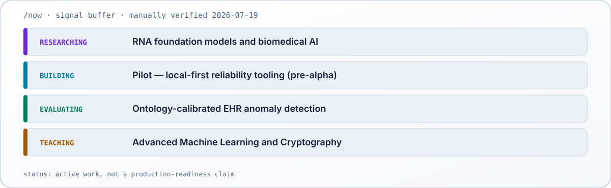
</picture>

## Mission board

Each card starts with the question, not the stack. Open a repository for the code, or expand its brief for the evidence and limitations.

<p align="center">
  <a href="https://github.com/AlirezaYegane/Ontology-Calibrated-Counterfactual-Explanations-for-Anomaly-Detection-in-EHRSequences">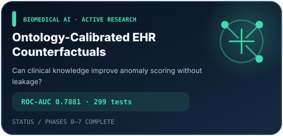</a>
  <a href="https://github.com/AlirezaYegane/pilot">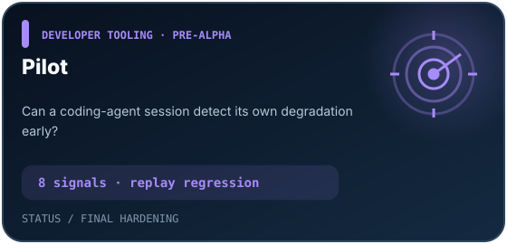</a>
</p>

<details>
<summary><strong>Open mission brief 01–02 · biomedical anomaly detection + coding-agent reliability</strong></summary>

### Ontology-Calibrated Counterfactual Explanations for EHR Sequences

- **Question:** Can structured clinical knowledge improve anomaly scoring and produce sparse counterfactual repairs without leaking synthetic answer-key information?
- **Built:** A leakage-controlled MIMIC-IV benchmark, real ontology scoring, detector ablations, and ontology-guided counterfactual generation.
- **Evidence:** ROC-AUC **0.7881**; **+0.052** over the legacy rule baseline; **89.99%** repair success among ontology-flagged anomalies; **299 passing tests**.
- **Status:** Phases 0–7 complete. Paper writing and the reproducibility package are next. These are research results, not clinical validation.
- **Stack:** Python · scikit-learn · clinical ontologies · MIMIC-IV · pytest

### Pilot

- **Question:** Can a long coding-agent session detect its own degradation before it becomes expensive, repetitive, or difficult to recover?
- **Built:** A local-first, SQLite-backed Claude Code plugin with eight degradation signals, health scoring, state transitions, warning policy, handoffs, CLI tooling, replay regression, and smoke tests.
- **Engineering signal:** Fail-silent hooks, deterministic fixtures, Ruff, mypy, pytest, pre-commit, latency benchmarks, and clean-install validation.
- **Status:** Pre-alpha hardening. Not presented as a stable release.
- **Stack:** Python · SQLite · CLI · Claude Code hooks · pytest

</details>

<p align="center">
  <a href="https://github.com/AlirezaYegane/powerbi-dax-assistant">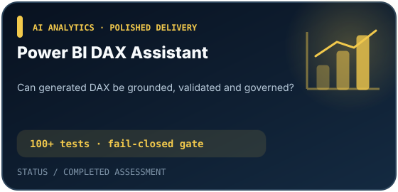</a>
  <a href="https://github.com/AlirezaYegane/advanced_machine_learning_assignment2">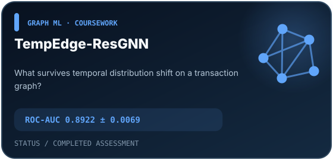</a>
</p>

<details>
<summary><strong>Open mission brief 03–04 · governed analytics + temporal graph learning</strong></summary>

### Power BI DAX Assistant

- **Question:** Can generated DAX remain grounded in the real semantic model and fail safely before execution?
- **Built:** A Streamlit/FastAPI assistant that generates schema-grounded DAX, validates it through a fail-closed gate, executes governed Power BI queries, and records redacted audit events.
- **Evidence:** **100+ passing tests**, a **100% live-model mini quality gate**, and a passed global project gate.
- **Status:** Completed technical assessment and polished local delivery.
- **Stack:** Python · FastAPI · Streamlit · Power BI · DAX · Entra ID · pytest

### TempEdge-ResGNN

- **Question:** What happens when transaction-graph models face realistic temporal distribution shift rather than a convenient random split?
- **Built:** A reproducible benchmark across classical, neural, and graph models on the Elliptic transaction graph, with temporal splits, multiple seeds, ablations, and timestep-level failure analysis.
- **Evidence:** Custom model ROC-AUC **0.8922 ± 0.0069**. The report also surfaces the sharp post-timestep-43 degradation instead of hiding it.
- **Status:** Completed Advanced Machine Learning coursework.
- **Stack:** Python · PyTorch · PyTorch Geometric · graph ML

</details>

<p align="center">
  <a href="https://github.com/AlirezaYegane/ConstructFlow-Agentic-Approval-Hub">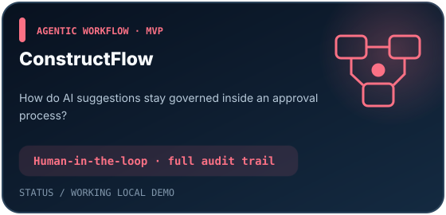</a>
  <a href="https://github.com/AlirezaYegane/ddim-cfg-cifar10">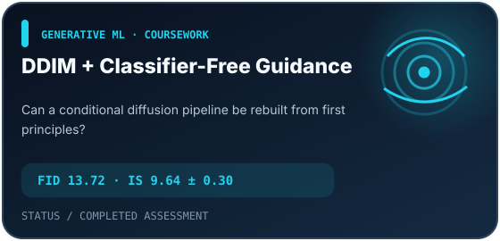</a>
</p>

<details>
<summary><strong>Open mission brief 05–06 · governed AI workflow + generative modelling</strong></summary>

### ConstructFlow Agentic Approval Hub

- **Question:** How can AI assistance remain traceable and subordinate to human decisions inside an approval workflow?
- **Built:** A governed prototype with structured intake, policy retrieval, AI-assisted analysis, human approval controls, controlled document generation, and a complete audit trail.
- **Status:** Working MVP and local demo; not production-hardened.
- **Stack:** Next.js · TypeScript · FastAPI · PostgreSQL · Chroma · Gemini · ReportLab

### DDIM with Classifier-Free Guidance on CIFAR-10

- **Question:** Can a conditional diffusion pipeline be implemented from first principles and evaluated beyond attractive sample grids?
- **Built:** A PyTorch DDIM implementation with a U-Net noise predictor, class conditioning, classifier-free guidance, EMA, reverse-process visualisation, and guidance/step-count ablations.
- **Evidence:** FID **13.72** and Inception Score **9.64 ± 0.30** after 400 epochs.
- **Status:** Completed Advanced Machine Learning coursework.
- **Stack:** Python · PyTorch · diffusion models · CIFAR-10

</details>

## Proof, not promises

<picture>
  <source media="(prefers-color-scheme: dark)" srcset="assets/proof-dark.svg">
  <source media="(prefers-color-scheme: light)" srcset="assets/proof-light.svg">
  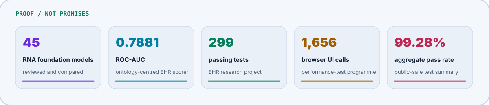
</picture>

<a id="research-route"></a>
## Research route — where the questions connect

My current research identity is not a list of unrelated domains. The common thread is **reliable AI under imperfect evidence**: leakage-controlled evaluation, clinical knowledge, temporal shift, reproducibility, and honest decisions about components that do not work.

<picture>
  <source media="(prefers-color-scheme: dark)" srcset="assets/research-constellation-dark.svg">
  <source media="(prefers-color-scheme: light)" srcset="assets/research-constellation-light.svg">
  
</picture>

**Research and writing**

- **A Comprehensive Survey of RNA Foundation Models Through the Lens of the Development Pipeline** — co-author and Research Assistant; **manuscript in final internal review**, not yet submitted or published.
- **Optimization of Internet Data Consumption Using Artificial Intelligence: Methods and Applications** — co-author; presented at the 16th DEA Conference in 2025.
- Current research engineering also includes RiNALMo reproduction and stabilisation, model-comparison evidence synthesis, and reproducible downstream evaluation.

<a id="engineering-route"></a>
## Engineering route — how an idea earns the right to ship

<picture>
  <source media="(prefers-color-scheme: dark)" srcset="assets/signal-path-dark.svg">
  <source media="(prefers-color-scheme: light)" srcset="assets/signal-path-light.svg">
  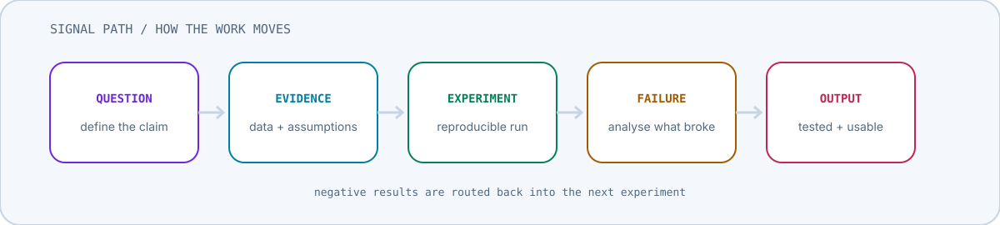
</picture>

<p align="center">
  
</p>

**Used in evidence, not collected as decoration:** PyTorch Geometric · pandas · NumPy · SHAP · Power BI · DAX · Power Query · Playwright · pytest · Ruff · mypy · pre-commit · LangChain · ChromaDB · REST APIs · Azure Static Web Apps · Azure DevOps.

```python
working_principles = {
    "claims": "measured",
    "experiments": "reproducible",
    "failures": "reported",
    "software": "tested",
    "documentation": "part of the build",
}
```

<a id="career-route"></a>
## Career route — the signal over time

<picture>
  <source media="(prefers-color-scheme: dark)" srcset="assets/career-timeline-dark.svg">
  <source media="(prefers-color-scheme: light)" srcset="assets/career-timeline-light.svg">
  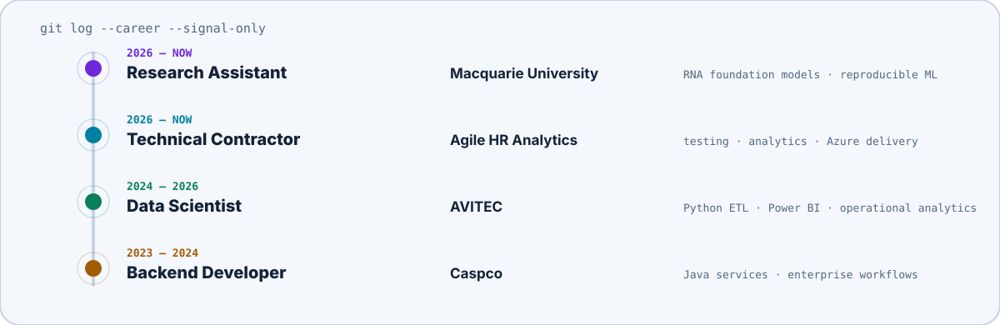
</picture>

Alongside research and engineering, I teach **Advanced Machine Learning** and **Cryptography** at Macquarie University. Previous teaching support has covered NLP, machine learning, probability, graph theory, and foundations of computing. I have also contributed as a volunteer judge at the FIRST LEGO League Asia Pacific Open Championship 2026 and as a conference volunteer at IEEE SERVICES 2026.

## Live GitHub telemetry

The contribution visual below is generated inside this repository from public GitHub activity. The committed bootstrap remains readable until the first workflow run, and the rest of the profile does not depend on it.

<p align="center">
  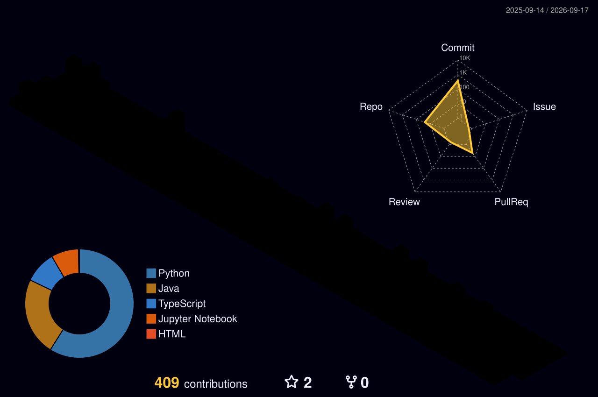
</p>

<details>
<summary><strong>Open secondary public-data widgets</strong></summary>

These cards are intentionally secondary: they are useful snapshots, not measures of expertise, and the README remains complete when a public service is unavailable.

<p align="center">
  
  
</p>

</details>

## Contact uplink

I’m open to thoughtful collaboration in biomedical AI, research software, machine learning evaluation, AI-assisted analytics, and reliable developer tooling.

<p align="center">
  <a href="mailto:alireza.yegane@mq.edu.au"><strong>alireza.yegane@mq.edu.au</strong></a>
  &nbsp;·&nbsp;
  <a href="https://www.linkedin.com/in/alireza-yegane"><strong>LinkedIn</strong></a>
  &nbsp;·&nbsp;
  <a href="https://github.com/AlirezaYegane"><strong>GitHub</strong></a>
</p>

<p align="center"><code>git log --human: careful claims · useful systems · curiosity with a test suite</code></p>

<!--
  Easter egg / source-code note:
  A polished output is nice. A reproducible path to the output is better.
  Try: python scripts/generate_visuals.py
-->
